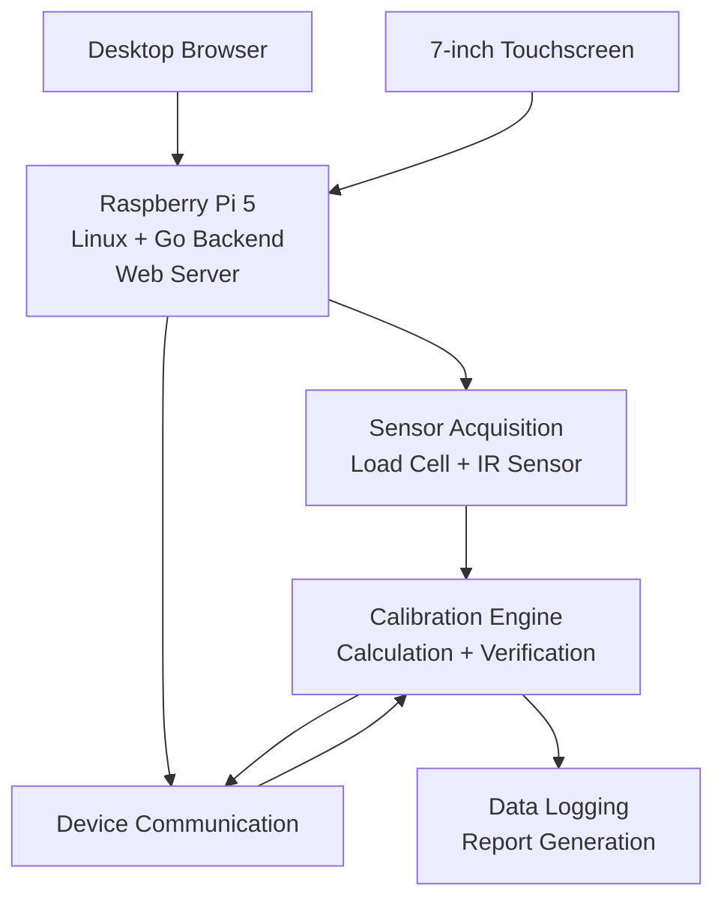
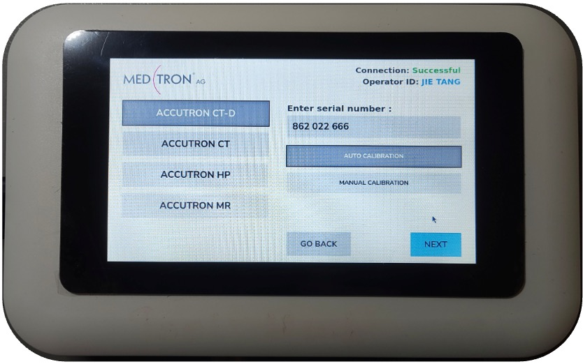

# Industrial Calibration System

**Go · Raspberry Pi 5 · Linux · Hardware Integration · Sensors · Web UI**

Portfolio reconstruction of an industrial calibration system developed during an R&D engineering internship in Germany.

The original system was designed to automate the calibration of medical-device injectors by integrating a **Go backend running on Raspberry Pi/Linux, sensor acquisition, device communication and a browser-based user interface**.

> **Note:** This repository does not contain proprietary company source code, internal communication protocols or confidential production data. The public implementation is being rebuilt independently for portfolio purposes.

---

## Demo

The following demonstration shows the system operating in **Manual Calibration mode**.

**Manual mode is used in the recording to keep the demonstration short.** In **Auto Calibration mode**, the system automatically processes the complete sequence of flow rates from **1 to 10 ml/s** without further operator intervention.

🎥 **[Watch the system demo](assets/system_demo.mp4)**

During calibration, each flow rate is displayed with a status:

* **Grey** — calibration in progress
* **Green** — calibration successfully validated
* **Red** — calibration could not be validated within the allowed iterations

---

## System Overview

The system guides the operator through the complete calibration workflow:

1. Operator authentication
2. Device model and serial-number configuration
3. Calibration mode selection
4. Sensor validation
5. Device configuration and injection
6. Measurement and data acquisition
7. Calibration calculation
8. Automatic verification
9. Iterative adjustment when required
10. Data logging and report generation

The objective of the **Auto Calibration** mode is to minimize operator intervention by executing the complete calibration sequence autonomously.

---

## System Architecture



The Raspberry Pi acts as the central controller of the system. The same backend can be accessed through a desktop browser or through a dedicated touchscreen connected directly to the Raspberry Pi.

---

## Calibration Workflow

The core of the system is an **iterative closed-loop calibration process**.

For each selected flow rate:

```text
Injection
   ↓
Sensor + device measurements
   ↓
Calibration calculation
   ↓
Updated calibration parameter
   ↓
New injection
   ↓
Verification
   ↓
Valid? ───── Yes ───→ Calibrated ✓
   │
   No
   ↓
Recalculate and repeat
```

If the calibration cannot be validated within the defined number of attempts, the system marks that flow rate as failed and continues with the remaining calibration sequence instead of entering an indefinite loop.

This allows the calibration process to run autonomously while continuously checking the validity of the results.

---

## Calibration Modes

### Auto Calibration

The system automatically executes the complete calibration process for all standard flow rates from **1 to 10 ml/s**.

Once started, the sequence progresses autonomously through measurement, calculation and verification for every flow rate.

### Manual Calibration

The operator can select specific standard flow rates or enter a custom value.

This mode is useful for testing, development and targeted calibration procedures.

---

## 7-inch Touchscreen Interface

In addition to the desktop browser interface, the system was designed to operate directly from a **7-inch touchscreen connected to the Raspberry Pi**.

The interface was adapted specifically for the smaller display and touch interaction, including dedicated layouts and on-screen input controls.



Both the desktop and touchscreen interfaces communicate with the same backend running on the Raspberry Pi.

---

## Operator Interface

The interface was designed around usability, traceability and safe operation.

Main features included:

* NFC operator authentication
* Manual username/password fallback
* Device model and serial-number configuration
* Auto and Manual calibration modes
* Real-time calibration status
* Visual flow-rate validation
* Emergency STOP control
* Calibration progress indication
* Data logging
* Report generation

A separate development view was also available for technical diagnostics and real-time sensor monitoring.

---

## My Contribution

During the project, I worked primarily on the **software and system-integration side** of the prototype.

My work included:

* Developing backend functionality in **Go** on a **Raspberry Pi 5 running Linux**
* Developing and integrating the **browser-based user interface**
* Connecting the software workflow with sensors and the external device
* Implementing system logic required for the calibration workflow
* Supporting hardware/software integration, testing and debugging
* Working with **Python and C++** where required for integration and supporting components
* Preparing technical documentation and presenting the final system

The project was developed within an international engineering team and required coordination between software, hardware and mechanical components.

---

## Technologies

**Software**

* Go
* Python
* C++
* HTML
* CSS
* JavaScript

**Platform**

* Raspberry Pi 5
* Linux

**Integration**

* Sensor acquisition
* Hardware communication
* Web server
* NFC authentication
* Data processing
* Report generation

---

## Public Portfolio Version

The original system was developed in an industrial environment and includes company-specific hardware, software and communication protocols.

For this reason, this repository does **not** publish:

* Original proprietary source code
* Internal device communication protocols
* Confidential calibration parameters
* Production data
* Personal operator information
* Company-specific implementation details

The public version is an **independent portfolio reconstruction** intended to demonstrate the software architecture, engineering approach and hardware/software integration behind the project.

---

## Author

**Nicolas Sancho**
Industrial Technologies Engineer
Mechanical Design · Automation · Embedded Software
