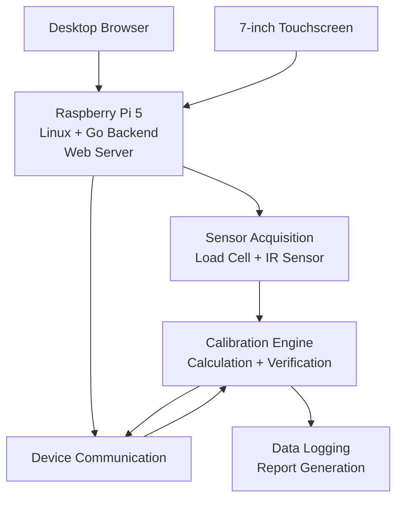

# System Architecture

This document provides a simplified overview of the architecture used in the original industrial calibration prototype.

The system was designed around a **Raspberry Pi 5 running Linux**, which acted as the central controller and hosted the main application logic and web server.

## High-Level Architecture

---

## Raspberry Pi 5

The Raspberry Pi 5 served as the central computing platform of the system.

Its main responsibilities included:

* Running the Linux operating system
* Hosting the Go backend
* Hosting the web server
* Managing communication with external hardware
* Receiving sensor data
* Coordinating the calibration workflow
* Providing the interface to both desktop and touchscreen clients
* Handling data processing and report generation

This architecture allowed the calibration system to operate as a compact, standalone engineering tool.

---

## Go Backend

The main application logic was implemented in **Go**.

The backend coordinated the different parts of the system, including:

* User-interface requests
* Device configuration
* Sensor acquisition
* Hardware communication
* Calibration-state management
* Data processing
* Result handling
* Report generation

The backend acted as the connection point between the user interface and the physical calibration hardware.

---

## Web Interface

The operator interface was implemented as a browser-based application.

This allowed the same backend to be accessed from multiple interface formats without duplicating the main application logic.

The interface was available through:

### Desktop Browser

A standard desktop browser could be used to access and operate the calibration system.

This interface was particularly useful during development, testing and technical demonstrations.

### 7-inch Touchscreen

A dedicated **7-inch touchscreen** connected to the Raspberry Pi provided a compact operator interface directly on the calibration system.

The interface was adapted specifically for:

* Smaller screen dimensions
* Touch interaction
* Large and accessible controls
* On-screen text input
* Operation without an external keyboard or mouse

Both interfaces communicated with the same backend running on the Raspberry Pi.

---

## Sensor Acquisition

The system integrated physical sensors used during the calibration process.

The sensor layer included components such as:

* Load-cell measurement
* Infrared sensing
* Supporting acquisition electronics

Sensor measurements were transferred to the application for validation, processing and use within the calibration workflow.

The system continuously checked the sensor state before and during operation to ensure that measurements were suitable for the current calibration step.

---

## Device Communication

The Raspberry Pi communicated directly with the external device being calibrated.

This communication layer allowed the system to:

* Configure the device
* Start calibration operations
* Receive operational data
* Transfer updated calibration information
* Coordinate repeated verification cycles

The exact communication protocol and company-specific commands are intentionally excluded from this public documentation.

---

## Calibration Engine

The calibration engine coordinated the iterative validation process.

Its responsibilities included:

* Receiving measurement data
* Processing calibration results
* Managing updated calibration parameters
* Requesting verification runs
* Determining whether a calibration was valid
* Handling unsuccessful attempts
* Advancing automatically to the next flow rate

The engine was designed to support both Manual and Auto Calibration workflows.

---

## Data Logging and Reporting

Calibration results were recorded during the process to support traceability and technical evaluation.

Once the selected calibration sequence was complete, the system could generate result documentation containing the relevant calibration data.

The public repository describes this functionality conceptually but does not include confidential production data or original company reporting formats.

---

## Separation of Operator and Development Functions

The system included different levels of interaction depending on the user.

The standard operator interface focused on:

* Authentication
* Configuration
* Calibration control
* Process status
* Safety controls

A separate development tool provided access to diagnostic functionality such as real-time sensor visualization and technical monitoring.

This separation helped keep the production interface simple while preserving more detailed information for development and testing.

---

## Public Architecture Note

This architecture description intentionally focuses on the overall engineering structure of the system.

The following are not included in this public repository:

* Proprietary device communication protocols
* Company-specific commands
* Confidential calibration algorithms
* Production parameters
* Internal network or hardware configuration details
* Original company source code

The purpose of this documentation is to demonstrate the system architecture, integration approach and engineering workflow without disclosing proprietary implementation details.
